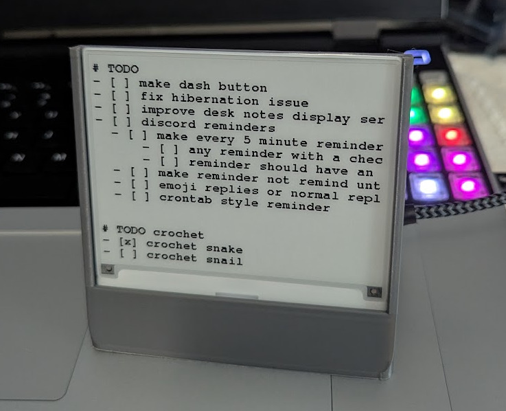

# Desktop Notes Display

For those who are good at writing down what they want to get done, but are bad at remembering to check that list here is the ADHD lifehack you've been looking for.

For my personal setup I use [obsidian](https://obsidian.md/) to take notes and [syncthing](https://syncthing.net/) to sync them between all my devices. You don't need to use these and you don't need to put the display on your desk.
My original idea for this project was for it to go on a fridge. I only later realized that when I'm at my desk is when I most need to be reminded of what I'm suposed to be doing. 
I do plan on making another version to go on a fridge in the future.

## Materials Needed

### Software

- [platformIO](https://platformio.org/) (or build the firmware some other way)
- [rust](https://www.rust-lang.org/) (to compile and run the webserver)

### Tools

- a 3D printer, or some other means of making a stand
- a soldering iron (or you can buy the [dev board](https://www.seeedstudio.com/Seeed-Studio-XIAO-ESP32C3-Pre-Soldered-p-6331.html) with pins pre soldered)

### Electronics

- [4.2" e-ink display](https://www.seeedstudio.com/4-2-Monochrome-ePaper-Display-with-400x300-Pixels-p-5784.html)
- [seeed studio XIAO ESP32-C3](https://www.seeedstudio.com/Seeed-Studio-XIAO-ESP32C3-3PCS-p-5920.html) (this is the 3 pack link, you don't need 3 its just a better deal)
- [ePaper Breakout Board](https://www.seeedstudio.com/ePaper-Breakout-Board-p-5804.html)

## Setup
- edit config files
  - edit [example_config.rs](web_server/src/example_config.rs) and rename it to `config.rs`
    - make sure `file_path` returns the path to the note you want to be displayed
    - `SERVER_URL` can be left at the default value but make sure you know the ip address of the computer for [config.h](ControllerFimware/include/example_config.h) 
  - edit [example_config.h](ControllerFimware/include/example_config.h) and rename it to `config.h`
    - if you are running everything on a local network, `WIFI_SSID` and `WIFI_PW` must be for the same network as the device running the [web server](web_server) (if its not all being run on a local network you shouldn't need instructions for editing the config file)
    - `SERVER_IP` should be the ip address of the device hosting the [web server](web_server)
    - `SERVER_PORT` can be left as the default value if you did not change it in [config.rs](web_server/src/example_config.rs)
- flash the [firmware](ControllerFimware) to the ESP32-C3 dev board
- connect the ESP devboard with the usb connector facing away from the ribbon connector
- print the included [stand file](STL_files) ([onshape link](https://cad.onshape.com/documents/5d75ae7dfb9c68bbb95b46f0/w/a159d735d8b0b14c8074ff40/e/3a443fd04e155175b09b9dea?renderMode=0&uiState=684daea25ec82e6503aed72f))
- Slide the display into the stand and connect the ribon cable to the breakout board
- launch the [web server](web_server) (run `cargo run --release` in the [web server directory](web_server)
- finnaly plug the ESP board into a power source once it connects to the network it will start grabing and displaying whatever the webserver is hosting

